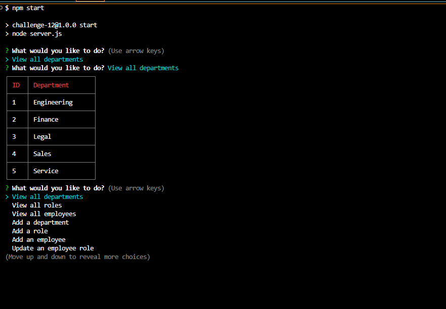

# Employee Tracker

## Table of Contents
- [Description](#description)
- [Installation](#installation)
- [Usage](#usage)
- [Questions](#questions)

## Description
this app is designed to store data of a company which includes storing all the departments roles and employees. you can also add data, and manipulate it.

https://app.screencastify.com/v3/watch/D1N5Kmq7fBxKB7PKsGQL

## Installation
by entering into the terminal of the parent folder and typing npm i and node index.js

## Usage
after running the app a sliding list will pop in the terminal. use your arrow keys to manuver to your desired command and affect the database accordingly.

## Questions
For any questions, you can reach me at:
- GitHub: [MIKEYP53](https://github.com/MIKEYP53)
- Email: mprz646@gmail.com
